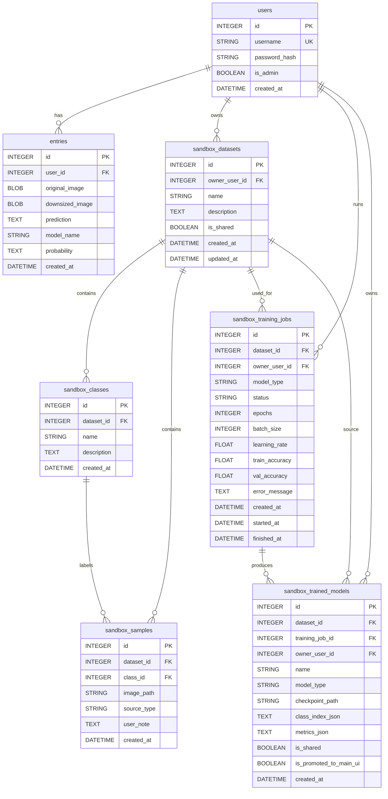

# Database Model (ER Diagram)

```mermaid
erDiagram
    users {
        INTEGER id PK
        STRING username UK
        STRING password_hash
        BOOLEAN is_admin
        DATETIME created_at
    }

    entries {
        INTEGER id PK
        INTEGER user_id FK
        BLOB original_image
        BLOB downsized_image
        TEXT prediction
        STRING model_name
        TEXT probability
        DATETIME created_at
    }

    sandbox_datasets {
        INTEGER id PK
        INTEGER owner_user_id FK
        STRING name
        TEXT description
        BOOLEAN is_shared
        DATETIME created_at
        DATETIME updated_at
    }

    sandbox_classes {
        INTEGER id PK
        INTEGER dataset_id FK
        STRING name
        TEXT description
        DATETIME created_at
    }

    sandbox_samples {
        INTEGER id PK
        INTEGER dataset_id FK
        INTEGER class_id FK
        STRING image_path
        STRING source_type
        TEXT user_note
        DATETIME created_at
    }

    sandbox_training_jobs {
        INTEGER id PK
        INTEGER dataset_id FK
        INTEGER owner_user_id FK
        STRING model_type
        STRING status
        INTEGER epochs
        INTEGER batch_size
        FLOAT learning_rate
        FLOAT train_accuracy
        FLOAT val_accuracy
        TEXT error_message
        DATETIME created_at
        DATETIME started_at
        DATETIME finished_at
    }

    sandbox_trained_models {
        INTEGER id PK
        INTEGER dataset_id FK
        INTEGER training_job_id FK
        INTEGER owner_user_id FK
        STRING name
        STRING model_type
        STRING checkpoint_path
        TEXT class_index_json
        TEXT metrics_json
        BOOLEAN is_shared
        BOOLEAN is_promoted_to_main_ui
        DATETIME created_at
    }

    users ||--o{ entries : has
    users ||--o{ sandbox_datasets : owns
    users ||--o{ sandbox_training_jobs : runs
    users ||--o{ sandbox_trained_models : owns

    sandbox_datasets ||--o{ sandbox_classes : contains
    sandbox_datasets ||--o{ sandbox_samples : contains
    sandbox_datasets ||--o{ sandbox_training_jobs : used_for
    sandbox_datasets ||--o{ sandbox_trained_models : source

    sandbox_classes ||--o{ sandbox_samples : labels
    sandbox_training_jobs ||--o{ sandbox_trained_models : produces
```
